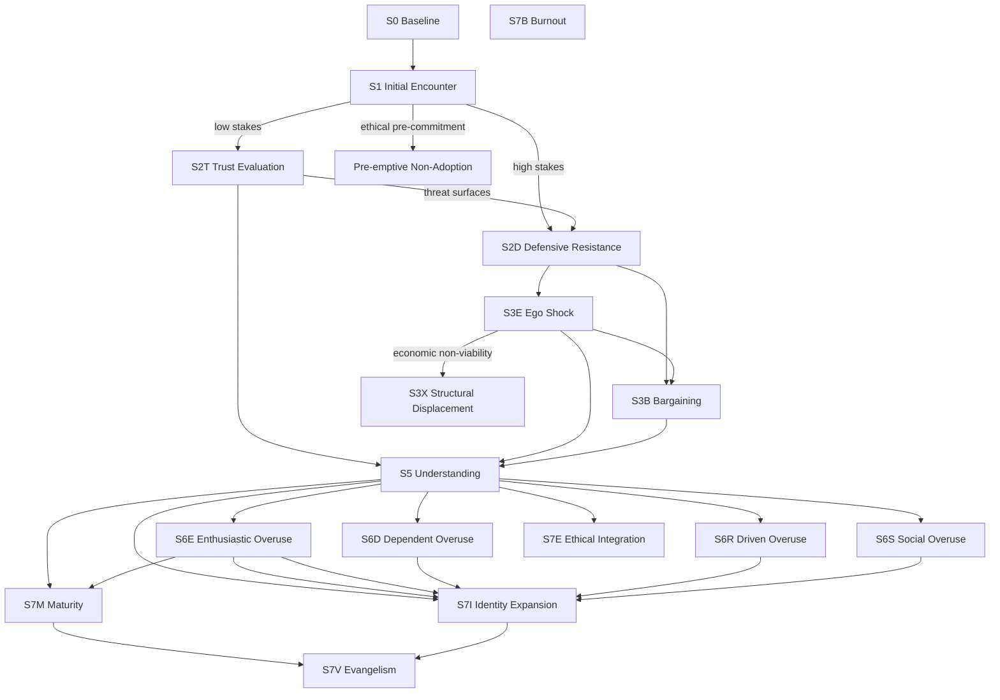

# Slice 01 — File Structure and Diagrams

Covers source items **1** (split into separate files) and **1b** (mermaid diagrams).

## What the source asks for

Split the single `Model5.md` into multiple files so each state and major section has its own file. Convert the existing ASCII state-transition diagram to mermaid.

## Concrete changes

### File split

Create the V6 folder per the layout in [00-Plan-Overview.md](00-Plan-Overview.md). The split is:

- One entry-point file `Model6.md` containing scope, axes summary, the reading guide, and links to every other file.
- One file per state under `states/`.
- One file per major cross-cutting section: triggers, social context, dropout, populations, healthiness, usage, observation guide, limits of operationalization.

The entry-point file should be readable on its own as a 5-minute introduction. State files and section files are reference material.

### Each state file's shape

Use the same structure for every state file so they are interchangeable from a reader's point of view:

```markdown
# Sxx — Name

> "Voice of the person quote."

One-paragraph plain-English description.

## Related literature
(was "Mechanism anchor" in V5; see slice 03)

## Identity Stakes / Delegation modulation
What changes in this state when stakes are high vs low and when delegation level is D1–D4.

## Transitions
- Inbound edges
- Outbound edges, with conditions

## ⚡ External triggers
Named events that change probability of entering or leaving. Empty if none — see slice 04.

## Healthiness
One paragraph. See slice 09 for the framing and slice 10 for per-state content.

## Observation markers
Concrete behavioral markers a practitioner could look for. See slice 10.

## Open questions / not yet tested
Conjectural claims the model makes about this state, flagged.
```

Not every state has content for every heading. Empty headings should be omitted, not left blank.

### Mermaid diagrams

The state graph in V5 uses ASCII boxes and arrows. Replace with mermaid. The diagram lives in `02-state-graph.md` and is referenced from `Model6.md`.

Proposed mermaid for the main graph (post-V6 structural changes from slices 02, 07, 08):

````markdown

````

Regression edges are not drawn (every state can regress to upstream states; rendering all of them would make the diagram unreadable). State the regression rule in prose just above the diagram.

Sub-diagrams to add:

1. **Identity Stakes × D-level intensity grid** — keep the existing table form, no diagram needed.
2. **Dropout severity plane** — small mermaid quadrant chart showing the four dropout regions.
3. **State coexistence matrix** — a mermaid table or a small markdown table showing which S6/S7 combinations are stable. Lives in `02-state-graph.md`. See slice 02 for content.

### Naming conventions inside files

- State labels stay as `S2D`, `S3B`, `S7M`, etc.
- Full names follow the label in headings: `S2D — Defensive Resistance`. (This matches the user-applied bulk rename across reviews and answers.)
- Voice-of-person quotes are kept as a markdown blockquote at the top of each state file.

## Risks / open questions

- **Cross-file linking discipline.** Once the model is split, the temptation is to repeat content across files. Don't. The entry-point file gives a one-line summary of each section and links out; the section file holds the detail.
- **Mermaid rendering.** Some markdown viewers don't render mermaid. The model instruction file says diagrams supplement, never replace, prose. Every diagram must have an equivalent prose description nearby.
- **Folder navigation.** A reader landing in a state file should be able to get to the entry point and to neighbouring states without scrolling through file trees. Add a small footer to each state file: `[← Model6.md](../Model6.md) | [States ↑](../states/)`.

## Verification checklist

- [ ] V6 folder exists, V5 untouched.
- [ ] Every state has its own file under `states/`.
- [ ] `Model6.md` is readable on its own in 5 minutes.
- [ ] Main state graph is mermaid, with prose description below.
- [ ] No file is over ~400 lines. If one is, split further.
- [ ] Every cross-file reference uses a relative markdown link.
