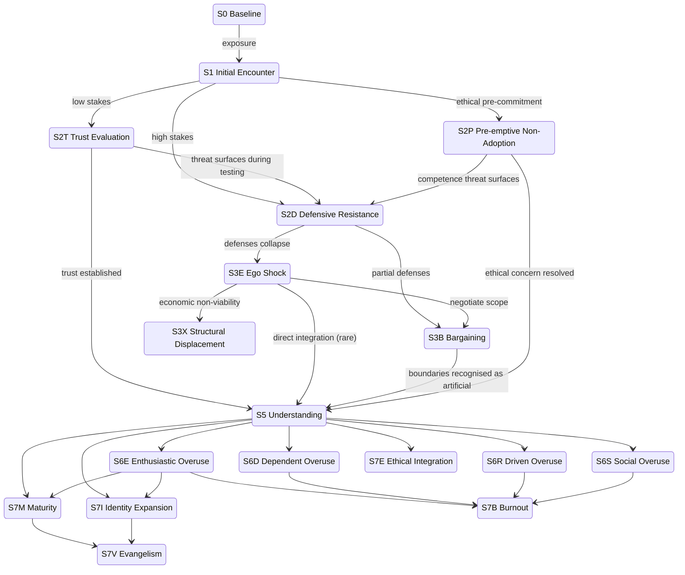

# State Graph

The model is a directed graph of states. State labels (S0, S1, S2T, …) are identifiers, not ordinals. Movement through the graph is non-linear; regression is a normal transition.

## Main graph

Regression edges are not drawn. Every state in S5 through S7 can regress to upstream states under the triggers described in [Model6.md](Model6.md) § Regression and cycling. Dropout is reachable from every state and is not drawn.

## Three structural notes for the reader

1. The fork after S1 (S2T versus S2D) is driven by Identity Stakes as a tendency, not a rule. Neither state is a prerequisite for the other; either can be entered directly from S1. A high-stakes person who is psychologically secure may enter S2T; a person with apparently low stakes may discover during testing that the stakes were higher than realised, which is the S2T → S2D edge. The transitions between the two states are **asymmetric**: S2T → S2D can happen when testing surfaces an identity threat; S2D → S2T does not happen without a regression event first, because defensive posture does not revert to open evaluation on its own.
2. The direct edge S3E → S5 is rare. Most people who appear to take it are actually doing accelerated S3B Bargaining and revisiting it later. **Testable —** distinguishing the direct path from a fast S3E → S3B → S5 path requires longitudinal observation; on a single observation the two are indistinguishable.
3. The S3E → S3X edge fires when a person reaches the conclusion that viable AI-collaborative work no longer exists in their domain. It is not a continuation of identity work; it is the entry into a structural problem alongside the identity problem.

## State Occupancy

States in this model can be **mutually exclusive**, **stably coexisting**, or **transitionally co-occurring**. The rules below are descriptive — they describe what tends to be observed, not what is logically forbidden.

### S6 states (parallel, with constraints)

- **S6E Enthusiastic Overuse and S6D Dependent Overuse are mutually exclusive.** They have opposite affect: S6E is energised and uncritical, S6D is anxious and self-doubting. A person can transition from one to the other (typically S6E → S6D after a confidence-eroding event) but does not stably occupy both.
- **S6R Driven Overuse and S6S Social Overuse can coexist.** In high-pressure cultures where being productive *is* the conformity, the two reinforce each other.
- **S6E Enthusiastic Overuse and S6R Driven Overuse can coexist** in startup-flavoured environments where personal enthusiasm aligns with productivity pressure.
- **S6D Dependent Overuse and S6S Social Overuse can coexist** in compliance-heavy environments where the person uses AI both because they doubt themselves and because everyone is watching.
- The combinations S6E + S6D and S6R + S6S are unstable — the affective profiles do not match.

**Conjecture —** the four coexistence claims above are based on observation of two cultural archetypes (startup, compliance-heavy). They are not directly tested.

### S7 states (parallel, intentionally overlapping)

Any S7 state can coexist with any other S7 state. Common combinations:

- S7M Maturity + S7E Ethical Integration (reflective practitioner)
- S7I Identity Expansion + S7V Evangelism (creative leader)
- S7M Maturity + S7V Evangelism (steady mentor)
- S7I Identity Expansion + S7E Ethical Integration (creator wrestling with what they are creating)

S7B Burnout co-occurs with the others as a phase, not a stable coexistence. When a person is in S7B Burnout they are typically not actively occupying their other end states; those resume on return.

### S6 to S7 (transition, not coexistence)

- **S6E Enthusiastic Overuse** can transition to **S7M Maturity** or **S7I Identity Expansion** but does not stably coexist with either. Maturity and uncritical enthusiasm are not compatible long-term residences.
- **S6D Dependent Overuse, S6R Driven Overuse, S6S Social Overuse** all lead most often to **S7B Burnout** as their primary exit. Direct routes from these to S7M Maturity are rare and usually require a structural change (new role, new manager, illness forcing re-evaluation).

### Cross-cutting

- **Dropout** is reachable from every state. See [dropout.md](dropout.md).
- **S3E Ego Shock** is reachable as a regression from every S5–S7 state.
- **S3X Structural Displacement** is reachable from S3E Ego Shock when economic non-viability is established.
- **S2P Pre-emptive Non-Adoption** is reachable only from S1 Initial Encounter (as a values-grounded exit at first encounter) and is not a regression destination.
- **S0 Baseline** has two readings: a transitional pre-encounter position and a terminal permanent-non-user position. See [states/S0-baseline.md](states/S0-baseline.md).

### Same-domain conflicts

In a single domain at a single time, the following pairs are alternatives, not coexistence:

- S2T Trust Evaluation and S2D Defensive Resistance.
- S3B Bargaining and S7M Maturity.

Across domains or across time, both pairs are fine.
