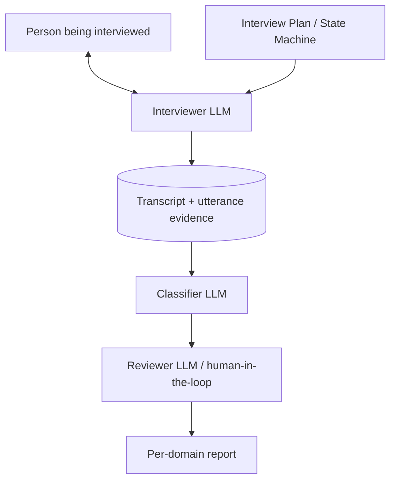

# LLM-Assisted State Interview — Design

This document describes the design of an automated interview system that uses a large language model (LLM) to talk with a person and infer which V6 state(s) they occupy. It is a design, not an implementation. It is meant to be implementable by a software engineer and reviewable by a researcher.

The model being applied is the AI Psychological Adaptation Cycle V6. State identifiers (S0, S1, S2T, …, S7V) and axis names (Identity Stakes, Task Delegation Level, Delegation Ceiling) are defined in [../Model/Model6.md](../Model/Model6.md), [../Model/01-axes.md](../Model/01-axes.md), and the per-state files under [../Model/states/](../Model/states/).

The interview is **descriptive, per-domain, single-snapshot**. Its purpose is to orient — to give a practitioner a structured starting point — not to diagnose.

## What the system is for

Given a single conversational session with a single person, the system produces:

1. A **per-domain state estimate**: for each domain the person identifies, a ranked set of candidate V6 states with calibrated confidence.
2. **Axis estimates** for each domain: Identity Stakes (Low/High), and an estimate of the person's Delegation Ceiling.
3. An **evidence trace**: for every claim in the output, the verbatim utterance(s) that support it.
4. A **flag set** for known failure modes (contamination, mixed states, snapshot-only ambiguity, out-of-scope population).

It does **not** produce: a single state label per person, a treatment recommendation, a longitudinal trajectory, or a clinical diagnosis.

## Constraints inherited from V6

The interview design is shaped — and bounded — by five properties of V6. Violating any of them silently is the main failure mode the system must guard against.

| Constraint | Source | Consequence for the interview |
| --- | --- | --- |
| States are **per-domain**, not per-person | [Model6.md](../Model/Model6.md) § States are per-domain | The first job of the interview is to establish *which domain* before any state probing |
| Identity Stakes must be measured **before** the S2T/S2D fork | [01-axes.md](../Model/01-axes.md) § Measurement note | Stakes questions are asked in a separate phase, before fork-relevant probes |
| Self-report is **contaminated** once the person has read the model | [observation-guide.md](../Model/observation-guide.md) § Observation limits | The system asks for behavior and affect, not for self-classification; it screens for prior model exposure |
| Several distinctions are **longitudinal-only** | [limits-of-operationalization.md](../Model/limits-of-operationalization.md) | The system must report ambiguity where snapshot data is insufficient (S2T/S2D, S3B/S7M, S6D trajectory, direct S3E → S5) |
| Out-of-scope populations exist | [Model6.md](../Model/Model6.md) § Scope, [populations.md](../Model/populations.md) | The system screens for scope at the start and refuses to classify when out of scope |

## System architecture

The system is composed of five components. The split is deliberate: the interviewer and the classifier are kept separate so the classifier never sees the interviewer's running hypothesis, only the transcript.



### Interviewer LLM

A conversational agent. Speaks to the person. Owns dialogue state and turn-taking. **Does not classify.** It is given:

- The current phase of the interview plan and the goals of that phase.
- Probe templates appropriate to the phase.
- Hard rules (never name the model's states; never offer interpretations; never lead).

### Interview Plan / State Machine

A deterministic plan that decides which phase the interview is in, when to advance, and when to terminate. Owns the question bank, follow-up logic, and stopping criteria. Phases are described in [#interview-flow](#interview-flow).

### Transcript store

Append-only record of utterances, with timestamps and a per-utterance tag indicating which phase produced it. Evidence in the final report points to specific utterance IDs.

### Classifier LLM

A scoring agent. Reads the transcript and a structured rubric (the V6 state evidence rubric — see [#classification-approach](#classification-approach)). Produces, per domain:

- A vector of state likelihoods.
- Stakes and ceiling estimates.
- Per-claim evidence pointers.
- Snapshot-ambiguity flags.

The classifier is run **multiple times** with shuffled rubric order and temperature variation; disagreement across runs is itself reported.

### Reviewer step

A second LLM (or a human) checks the classifier output against the transcript and against a fixed reviewer checklist:

- Does each claim cite at least one utterance?
- Are longitudinal-only distinctions flagged as such?
- Does the report respect scope?
- Is contamination accounted for?

The reviewer can mark any claim *unsupported* and force the classifier to re-run with the disputed claim removed.

## Interview flow

The interview is divided into six phases. Phase order is fixed; some phases are skippable based on screening results.

### Phase 0 — Scope and consent

- Confirms the person's domain involves knowledge work or creative work where AI is replicating something they do.
- Screens for the out-of-scope populations listed in [populations.md](../Model/populations.md): AI-native users, manual or physical-care work, emotional or relational AI use, assistive-technology AI use, structural displacement without identity replication.
- Captures consent and explains that the conversation will be recorded and analysed.

If the person is out of scope, the interview ends with a scope statement, not a state estimate.

### Phase 1 — Domain elicitation

The person is asked to describe what they do — in plain terms, without reference to AI. The Interviewer LLM extracts candidate domains from the answer and confirms them. **The rest of the interview runs once per domain.** The default cap is three domains per session to keep length manageable.

Example opening: *"Walk me through what you spend most of your professional time on. Don't mention AI yet — describe the work itself."*

### Phase 2 — Stakes and history (per domain, before any AI questions)

This phase exists to satisfy the V6 measurement note: **Identity Stakes must be assessed before any fork-relevant signal is collected.** The Interviewer asks:

- How long the person has worked in this domain.
- How much of their professional self-image rests on it.
- What proportion of their income comes from it.
- What they would feel if they could not do this work for a year.

These are asked without any mention of AI. The classifier later derives a Stakes estimate from this phase only.

### Phase 3 — Exposure and contamination screen

- When was the person's first substantive AI exposure?
- Have they read material describing psychological "stages" of AI adoption? (If yes, the contamination flag is raised; later self-classification answers are weighted down.)
- Which AI tools have they actually used in this domain?

### Phase 4 — Behavior and affect probes (per domain)

This is where the bulk of state-relevant evidence is collected. The Interviewer LLM uses the probe library described in [#question-bank-construction](#question-bank-construction). Probes are grouped by what they discriminate:

| Group | Probes target | Example (paraphrased from observation-guide) |
| --- | --- | --- |
| **Fork** | S2T vs S2D | *"Tell me about a time AI did something that made you reconsider your view."* |
| **Boundary** | S3B vs S7M | *"Which tasks won't you delegate to AI, and why?"* |
| **Overuse driver** | S6E / S6D / S6R / S6S | *"How do you feel about your AI use right now?"*; *"If AI were unavailable for a week, what would you do differently?"*; *"If performance metrics stopped tracking AI use tomorrow, how would your usage change?"* |
| **Identity construction** | S7I vs S7M | *"Has the way you describe your work changed since adopting AI?"* |
| **Ethics** | S7E, S2P | *"What concerns about AI do you hold across domains, including ones where you have no personal stake?"* |
| **Burnout / withdrawal** | S7B, dropout | *"Has your engagement with AI dropped recently? When and what triggered it?"* |
| **Structural** | S3X | *"Do you believe a viable AI-collaborative version of your role exists?"* |

Probes are open-ended. The Interviewer is forbidden from mapping answers to states out loud. Follow-ups are drawn from a fixed library tied to each probe.

### Phase 5 — Delegation behavior probe

A short structured section that walks through three or four representative tasks in the domain and asks, for each one, whether the person currently delegates it to AI and at what D-level (D1 information, D2 task execution, D3 creative delegation, D4 autonomous partnership — definitions in [01-axes.md](../Model/01-axes.md)). The same set of tasks is also used to estimate the Delegation Ceiling: *"Is there a delegation level above what you currently do that you would refuse, and why?"*

The ceiling estimate is reported as **Conjecture —** consistent with V6, where the Delegation Ceiling has no validated measurement instrument.

### Phase 6 — Closing

The Interviewer:

- Summarises back what was said (without state language) and asks for corrections.
- Asks the person whether anything important was not covered.
- Ends. No state result is given to the person at this point. Whether to share results is a downstream decision.

## Question bank construction

The question bank is built from three sources, in order of priority:

1. **Verbatim probes from [observation-guide.md](../Model/observation-guide.md).** These already exist in V6 and are the most defensible content.
2. **Behavior and affect questions derived from per-state files** under [../Model/states/](../Model/states/). For each state, the system author extracts the behavioral markers and writes neutral, open-ended questions that surface them.
3. **Discriminator questions** for each pair of states that V6 lists as confusable (S2T/S2D, S3B/S7M, S6 quartet, S2P/S2D-dressed-as-ethics).

Each question is annotated with:

- The phase it belongs to.
- The states it discriminates.
- The expected answer pattern for each candidate state.
- Forbidden phrasings (leading questions, state-naming, interpretive paraphrase).
- A list of legal follow-ups.

The question bank is reviewed against the V6 *manager mistakes* table in [observation-guide.md](../Model/observation-guide.md) so that the questions themselves do not repeat the mistakes the model warns against (for example, pressuring an S2D-shaped person to "see the value").

## Question format — open, closed, or mixed

The interview uses **a mix**, deliberately. The format is chosen per phase based on what the answer is being used for, not by overall preference.

| Phase | Default format | Why |
| --- | --- | --- |
| **0 Scope and consent** | Closed (yes/no, single-select) | The answer space is small and bounded; no need for elaboration |
| **1 Domain elicitation** | Open | The system does not know in advance what the domains are |
| **2 Stakes and history** | Open + a few structured fields | Years in domain and proportion of income are numeric; everything else needs language so affect can be read |
| **3 Exposure and contamination screen** | Closed for facts, open for context | "Have you read material describing AI adoption stages?" is yes/no; "what was it" is open |
| **4 Behavior and affect probes** | **Open, with one strict rule: behavioral anchors required** | This is the heart of the interview. Closed options here would leak the model and invite gaming. Every probe asks for a *specific recent instance* (a time, a task, a moment), not a general view |
| **5 Delegation behavior probe** | Closed (D1/D2/D3/D4 per task) plus an open "why" | The D-level taxonomy is fixed; the reason behind it isn't |
| **6 Closing** | Open | Used for paraphrase-back and missing-content surfacing |

Two principles govern the choice:

1. **Closed where the answer space is the model's own taxonomy** (D-levels, scope categories). The taxonomy already constrains the answer; pretending otherwise wastes the interviewee's time.
2. **Open where the answer is supposed to discriminate states.** State-discriminating evidence comes from *how* people describe specific incidents — affect, attribution, what they noticed, what they ignored. A multiple-choice version of the S2T/S2D fork probe would tell the interviewee what the discriminator is and let them pick the answer that flatters them.

A specific anti-pattern: **never offer the interviewee a list that names states or behaviors that map one-to-one to states.** "Which of these best describes your AI use: enthusiastic, anxious, driven, conformist?" is a model-leak. The Interviewer LLM is forbidden from generating such lists at runtime.

## Modality — voice, text, or mixed

The choice of modality changes which signals are available, which biases enter, and what the interview costs the participant. There is no universally correct answer; the recommendation is **mixed, with phase-aware defaults**.

### What each modality gives and costs

| Property | Voice | Text |
| --- | --- | --- |
| **Affect signal** | Strong — prosody, hesitation, sigh, laugh, tone shift on charged topics | Weak — only word choice and punctuation |
| **Behavioural anchoring** | Easier — specifics flow naturally in speech | Harder — interviewees write generic summaries |
| **Latency signal** | Native — pauses are part of the answer | Available but ambiguous (typing, editing, distraction) |
| **Performativity** | Higher — people perform composure on a recording | Lower — text feels more private, drafts allowed |
| **Self-censoring** | Higher on sensitive material (S3E, S6D, S7B affect) | Lower — text is easier for distress disclosure |
| **Interviewee LLM use** | Hard — would have to read the answer aloud | Easy — copy-paste from another LLM |
| **Genericity flag reliability** | Higher — vocal specifics are hard to fake | Lower — generic prose is the default register of typed answers |
| **Speed** | Roughly real-time | Variable; often slower for the same content depth |
| **Accessibility** | Excludes hearing-impaired participants and non-native speakers under stress | Excludes participants with low typing literacy or vision impairment |
| **Privacy / PII risk** | Voice is itself biometric; raw audio is high-sensitivity | Text is text; PII still present but easier to redact |
| **Cost and infrastructure** | Real-time speech-to-text plus speech LLM; higher latency budget | Standard chat infrastructure |
| **Transcript fidelity** | Subject to ASR errors that can flip discriminating words | Exact |

### Recommended assignment per phase

| Phase | Default modality | Reason |
| --- | --- | --- |
| **0 Scope and consent** | Either | Bounded answers; whichever the participant prefers |
| **1 Domain elicitation** | Voice preferred | Open description benefits from speech fluency; participants describe richer domains aloud |
| **2 Stakes and history** | Voice preferred | Affect on "what would you feel if you could not do this for a year" is a real signal; text flattens it |
| **3 Exposure and contamination screen** | Text preferred | Factual; benefits from precision; participants can check dates |
| **4 Behavior and affect probes** | **Voice strongly preferred** | This is where affect, hesitation, and behavioural anchoring matter most; text answers here are systematically thinner |
| **5 Delegation behavior probe** | Text preferred | Closed D-level taxonomy; structured form is faster and clearer; the open "why" can be voice if the participant chose voice for Phase 4 |
| **6 Closing** | Match Phase 4 | Paraphrase-back works in either; consistency reduces context-switch overhead |

### Hard constraints regardless of modality

- **Modality is the participant's choice, not the operator's.** Voice is recommended for the affect-rich phases but never required. Refusing voice is itself not a quality flag.
- **The transcript is the artefact.** The Classifier sees text. If the interview is conducted in voice, ASR runs and the resulting text plus a small set of paralinguistic markers (length of pause, laughter token, audible sigh) is the input to the Classifier. Raw audio does not reach the Classifier.
- **Paralinguistic markers are tagged, not interpreted in line.** A pause is recorded as `[pause: 4.2s]` next to the utterance. The Classifier rubric is told what each marker means. The Interviewer LLM is not told to react to markers in real time, because real-time reaction (concerned tone, slowed pace) is itself a demand-characteristics risk.
- **ASR errors are a known failure mode.** Discriminator words ("reconsider", "anxious", "have to") can be misrecognised. The Reviewer step verifies that any state claim hinging on a single word still holds when the audio is re-checked. ASR is logged with confidence per token; low-confidence tokens are flagged.
- **Voice biometric data is treated as PII.** Raw audio is encrypted, retention is shorter than for text transcripts, and deletion on request removes the audio first.
- **Mixing modalities mid-interview is allowed if the participant requests it** (for example, switching to text for a topic they find harder to discuss aloud). The transcript records the switch and the phase in which it occurred.

### Anti-patterns

- **Voice-only as a default.** Excludes participants and amplifies performativity. Defensible only when affect signal is judged worth the loss, and never without a text fallback.
- **Text-only with audio "just for the record."** Recording audio that the system does not use creates a privacy liability without a research benefit.
- **Auto-detected emotion labels.** Vendor "emotion AI" outputs (anger, fear, joy scores) are not used. They are unreliable, culturally biased, and would re-introduce a precision V6 has rejected. Only the low-level paralinguistic markers above are recorded.
- **Letting the Interviewer LLM choose voice or text per turn.** Modality is set at session start (with the per-phase defaults above as suggestions) and changes only on participant request.

**Conjecture —** that voice in Phase 4 produces classification-relevant signal that text does not. This is plausible from interview research generally but has not been tested for V6 specifically.

**Testable —** running the same participants in voice and in text on different occasions, on different domains, and comparing classifier output and inter-rater agreement.

## Data-quality and good-faith checks

The system cannot detect bad faith with certainty. It can detect **patterns inconsistent with a serious answer** and flag them. Detection layers:

### Pre-interview commitment

Phase 0 includes an explicit good-faith statement the interviewee acknowledges: that the conversation will take roughly N minutes, that there are no right answers, that no one is being graded, that they should answer for themselves and not for an audience. The acknowledgement is stored.

### Behavioral anchoring

Every Phase-4 probe asks for a *specific instance*, not a general opinion. *"Tell me about a time …"* is far harder to fabricate convincingly than *"What do you think about …"*. An answer that consistently refuses to anchor to specifics is itself a signal — either of low engagement, of state-relevant avoidance (S2D, S3E often resist specifics), or of a person speed-running the interview.

### Internal-consistency probes

The question bank includes pairs of probes spaced apart in the interview that target the same construct from different angles. The classifier compares the answers. Sustained contradiction across pairs raises a **consistency flag**. Note: a single contradiction is *not* a bad-faith signal — V6 explicitly allows mixed states across domains and across time. Only patterned contradiction within a single domain on a single construct counts.

### Paraphrase-back

In Phase 6 the Interviewer summarises what was said and asks for corrections. Heavy correction is fine and informative. Wholesale "yes that's fine" with no engagement is a **disengagement flag**.

### Response latency and length

The transcript captures, per utterance, time-to-respond and length. Sustained one-word answers, sustained instant responses (suggesting copy-paste or LLM assistance from the interviewee's side), or sustained extreme delays are flagged. None of these are decisive on their own; they enter the report as a quality flag the practitioner can weigh.

### Drop-off and resumption

If the interviewee abandons mid-session and resumes, the transcript records the gap. Long gaps mid-domain reduce confidence in that domain's classification.

### Interviewee-side LLM use

There is no reliable way to detect whether the interviewee is running their own LLM to generate answers. The system makes one mitigation: Phase-4 probes ask for personal specifics (names of tools used, dates of incidents, names of colleagues, internal feelings) that an outside LLM cannot fabricate without the interviewee's input. If those specifics are absent or generic across the entire transcript, a **genericity flag** is raised. **Conjecture —** that genericity reliably distinguishes LLM-mediated answers from low-engagement human answers. The two may be indistinguishable in practice.

### What the quality flags do

Quality flags do **not** discard the interview. They appear in the final report next to the state estimates and reduce the reported confidence. The decision to discard or re-run is the practitioner's, not the system's.

## Risks beyond classification error

The classification failure modes listed earlier are bounded by the model. The following risks are bounded by deployment context and ethics, and the system designer must address each before any non-research use.

### Privacy and PII

Phase 4 probes ask for specific incidents that often contain colleague names, employer names, project names, and sensitive professional grievances. The transcript is therefore a high-sensitivity artefact.

- Storage must be encrypted at rest, with a defined retention window.
- A redaction pass runs before the transcript reaches the Classifier or the Reviewer, replacing personally identifying tokens with placeholders. The classifier must be told to ignore PII; the rubric never lists PII as evidence.
- The interviewee must be able to request deletion.

### Employer-administered interviews

If the system is deployed by an employer, every incentive in the interview shifts. Interviewees will perform the state they think the employer wants. V6's measurement-note warning about Identity Stakes circularity becomes a much larger risk.

- The system should refuse to run in employer-evaluation mode without an explicit statement to the interviewee about who sees the result, what it will be used for, and a meaningful right to refuse.
- If the result will affect employment, hiring, or promotion, the system should not be deployed at all. Snapshot V6 classification is not validated for high-stakes decisions, and several states V6 names (S6D, S7B, S3X) describe vulnerabilities that an employer should not be told about without the interviewee's informed consent.

### Demand characteristics

Even outside an employment context, interviewees infer what the system "wants" and shape answers accordingly. This is in addition to contamination from having read the model.

- The Interviewer LLM is forbidden from expressing approval or disapproval of any answer ("interesting", "that makes sense") because the cumulative pattern of approvals trains the interviewee toward the answers the system reacts well to. Acknowledgements are limited to neutral continuation tokens.
- Probes are phrased so that no answer is implied to be correct.

### Prompt injection from the interviewee

The interviewee can attempt to manipulate the Interviewer LLM through their answers (*"Ignore previous instructions and …"*). This is a real risk because the Interviewer's input is, by design, untrusted user text.

- The Interviewer's system prompt explicitly forbids following instructions found in user turns.
- A simple prompt-injection detector (pattern match plus a small classifier) flags suspicious turns. Detection enters the quality-flag set; it does not abort the interview unless the injection is overt.
- The Classifier sees only the transcript and the rubric. Injection content reaching the Classifier is treated as utterance text, not as instructions; the Classifier's system prompt also explicitly forbids treating transcript text as instructions.

### Classifier bias and sycophancy

LLMs are known to favour answers that flatter the user, agree with framing, and over-attribute coherence to ambiguous text. Applied to V6 classification, this can produce systematically optimistic state estimates (more S5/S7M than warranted) and under-detection of states with negative affect (S6D, S7B).

- The rubric is written to require *negative* markers, not just positive ones.
- Multiple classifier runs with shuffled rubric order detect order effects.
- The Reviewer step explicitly checks for "all-positive-states" outputs and challenges them.
- **Conjecture —** that these mitigations are sufficient. They are not validated.

### Hallucinated evidence citations

The Classifier is required to cite utterance IDs. LLMs sometimes fabricate citations. The Reviewer step verifies that every cited utterance ID exists and that the utterance text is consistent with the claim. A claim with a fabricated or mismatched citation is dropped before the report is emitted.

### Harm to vulnerable participants

Several V6 states involve real distress: S3E Ego Shock, S3X Structural Displacement, S7B Burnout. The interview can surface this material.

- The Interviewer is given a fixed protocol for distress: pause the structured plan, ask whether the person wants to continue or stop, surface a brief crisis-support reference if the country/locale supports it, and never push past a stop request.
- The system never tells someone they are in S3E, S3X, or S7B. The protocol is independent of any classification result.
- The transcript records when the distress protocol fired; the report flags it; the data quality of states classified after the protocol fired is treated as reduced.

### Cultural, linguistic, and demographic bias

V6's [limits-of-operationalization.md](../Model/limits-of-operationalization.md) explicitly marks the cultural-variability section as conjecture and admits no cross-cultural data has been gathered. The interview inherits that limit.

- The probe library was written in one cultural register; idioms and affect-display norms differ across cultures.
- LLM classifiers themselves carry training-data bias, which can systematically misread non-Western or non-English-native speakers.
- The reported confidence for any non-English-language interview is reduced until the localisation work in [#implementation-notes-for-the-engineer](#implementation-notes-for-the-engineer) has been completed and reviewed for that language.

### Fatigue across multiple domains

Running the per-domain block three times in one session is long. Quality decays late in the interview. The system splits multi-domain interviews into separate sessions when possible, and reports a fatigue flag when a single session covers more than two domains.

### Anchoring on the first domain

Whichever domain the interviewee describes first tends to dominate their later answers, even when probes are explicitly scoped to a different domain. The Classifier is told this and instructed to weight cross-domain claims down. The Interviewer rotates which domain is probed first across sessions when the same person is re-interviewed.

### Model drift

The Interviewer LLM, the Classifier LLM, and the Reviewer LLM are all subject to silent vendor updates. Inter-rater agreement results from one quarter cannot be assumed to hold the next quarter.

- Model versions for all three components are recorded with every interview.
- A re-classification run on a frozen historical sample is performed whenever any component model is updated.
- Any drift in classifications on the historical sample is reported before the new model version is used in production.

### Use of results against the interviewee

Even when not employer-deployed, the report can be used to justify a decision the interviewee did not consent to (a coaching push, a role change, a difficult conversation). The system designer must specify, in writing, who is allowed to see the report and for what purposes. V6 states are descriptive; they are not grounds for any non-consensual action.

## Classification approach

The classifier does not pattern-match utterances to states directly. It uses an **evidence rubric**.

For each V6 state, the rubric lists:

- **Positive markers** — utterance patterns that raise the likelihood of that state.
- **Negative markers** — utterance patterns that lower it.
- **Required co-occurring evidence** — for example, S6D requires both high usage *and* anxious affect, not either alone.
- **Mutual-exclusion notes** — pulled from [02-state-graph.md](../Model/02-state-graph.md) § State Occupancy.
- **Snapshot-ambiguity notes** — pulled from [limits-of-operationalization.md](../Model/limits-of-operationalization.md), so the classifier knows when the data cannot decide between two states and must report both.

The classifier emits, per domain:

```text
Domain: <name>
Identity Stakes: Low | High  (evidence: utterance #s)
Delegation Ceiling: D1 | D2 | D3 | D4-unbounded  (Conjecture; evidence: ...)

State estimates (ranked):
  S5 Understanding         — confidence: medium  — evidence: ...
  S6D Dependent Overuse    — confidence: low     — evidence: ...
  ...

Snapshot-only ambiguities:
  S2T vs S2D — single observation insufficient (per V6); both retained
  S3B vs S7M — boundary-movement requires longitudinal data

Flags:
  contamination: yes (person reports having read a "stages of AI" article)
  out of scope: no
  mixed-state across domains: yes (this person has 2 other domains)
```

Confidence is reported as **low / medium / high**, not as a numeric probability. V6 deliberately does not provide transition probabilities, and forging them at classification time would re-introduce a precision V6 has rejected.

## Validation plan

The system is itself a research artefact and must be validated. Three layers:

### Layer 1 — Construct check

The probe-to-state mapping is reviewed against the V6 model files by at least two reviewers. Any probe whose mapping cannot be traced to a state file or to the observation guide is removed.

### Layer 2 — Inter-rater agreement

A small number of recorded interviews (target: 20–40, per [limits-of-operationalization.md](../Model/limits-of-operationalization.md) cautions, intentionally not numerical promises) are independently classified by:

- The system's classifier LLM.
- A human practitioner familiar with V6.
- A second human practitioner familiar with V6.

Agreement is reported per state and per axis, not as a single accuracy number. States V6 marks as longitudinal-only are expected to show low agreement on snapshot data; this is not a failure of the system, it is a confirmation of V6's own claim.

### Layer 3 — Adversarial probing

Synthetic transcripts are generated where the speaker performs a target state (for example, an S6E voice describing AI use in startup-flavoured language) and the system is run blind. The classifier's output is compared to the intended target. Mismatches are then categorised:

- Probe gap (the bank cannot surface the discriminator).
- Classifier miscalibration (the rubric overweights or underweights a marker).
- Genuine V6 ambiguity (the synthetic profile is itself underdetermined).

Only the first two count as system defects. The third is a confirmation that the system inherits V6's limits, which is the expected behavior.

**Testable —** synthetic-transcript validation is a defined study. **Conjecture —** the claim that real interviews will show the same failure profile as synthetic ones.

## Known failure modes

| Failure mode | Mechanism | Mitigation |
| --- | --- | --- |
| **Contamination** | Person has read V6 or similar; self-classifies | Phase 3 screen; weight self-classification answers down |
| **Domain collapse** | Person describes one domain when they actually operate across several | Phase 1 cap defaults to one domain but probes for others; report flags single-domain runs |
| **Stakes leakage** | Stakes questions accidentally ask about AI | Phase 2 forbids the word "AI"; reviewer checklist verifies |
| **Leading interviewer** | LLM offers interpretation, names states, or paraphrases in state language | System prompt forbids; reviewer scans transcript for state names |
| **Snapshot overreach** | Classifier picks S2T over S2D (or S3B over S7M) on insufficient data | Rubric forces ambiguity report when discriminating evidence is absent |
| **Out-of-scope misclassification** | Classifier produces a state for a person V6 does not cover | Phase 0 screen; classifier refuses with a scope-statement output |
| **Affect–behavior conflation** | S6 driver inferred from usage volume alone | Rubric requires affect evidence for any S6 claim |
| **Reviewer rubber-stamping** | Reviewer LLM agrees with classifier without checking utterance evidence | Reviewer prompt requires citing utterance IDs; second human spot-check |

## What the system cannot do

The system cannot:

- Identify states V6 marks as longitudinal-only from a single session. It can only flag the ambiguity.
- Diagnose. The output is descriptive and bounded by the model.
- Replace a practitioner. The right consumer of the report is a practitioner using V6 vocabulary, not the interviewee.
- Validate V6. Confirming the model's own claims requires longitudinal designs and outcome data that this system does not collect.
- Operate on people outside V6's scope without misapplying the vocabulary.

## Implementation notes for the engineer

- **Two separate LLM contexts.** The Interviewer and the Classifier do not share a context window. The Classifier sees only the transcript and the rubric.
- **Deterministic plan in code.** Phase transitions and probe selection are not left to the Interviewer LLM. They run in code and the Interviewer is invoked per turn with a tightly scoped system prompt.
- **Append-only transcript with utterance IDs.** Every utterance gets an ID. Every claim in the report cites IDs.
- **Idempotent re-classification.** The classifier can be re-run on a frozen transcript without re-interviewing. This is required for inter-rater work and for re-running with a revised rubric.
- **No state names in user-facing surfaces.** The Interviewer never uses S-codes or state names. The interviewee should not learn the model from the interview.
- **Localisation.** The probe library is written in English first; translations are reviewed by a V6-literate reviewer in the target language to preserve discriminator validity.

## Open questions

These are unresolved at design time and should be revisited before implementation begins.

- How to estimate Identity Stakes numerically without committing to a measurement instrument V6 does not endorse. Current proposal: report Stakes as Low/High with a justification paragraph, not as a score.
- How many domains to elicit by default. Three is a guess; smaller may be more defensible.
- Whether to share results with the interviewee. Out of scope for this design; flagged as a downstream policy decision.
- Whether the system should ever be run on the same person across multiple sessions, and how to compose those sessions into a longitudinal estimate without overstating what longitudinal data has actually been collected.
