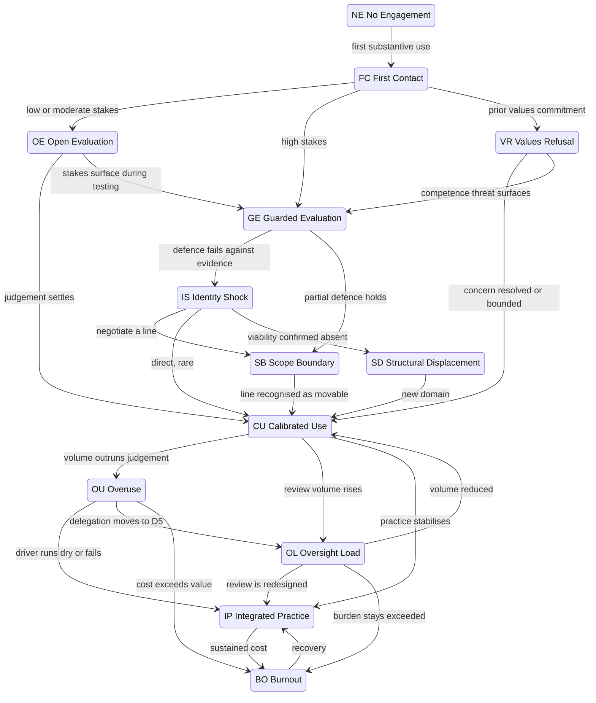

# The Graph

The model is a directed graph of positions. Codes are handles, not ordinals — see [02-identifiers.md](02-identifiers.md). Movement is non-linear, regression is a normal edge, and a person occupies one position per domain across several domains simultaneously.

## Families

Five families group the positions. A family is descriptive metadata that says what kind of thing its members are. It is not part of the identifier and carries no order.

| Family | Members | What the members share |
| ------ | ------- | ---------------------- |
| **Pre-engagement** | `NE` No Engagement, `FC` First Contact | No stance toward AI in this domain has formed yet |
| **Stance** | `OE` Open Evaluation, `GE` Guarded Evaluation, `VR` Values Refusal | A posture has formed; the person is deciding what AI is to them |
| **Disruption** | `IS` Identity Shock, `SB` Scope Boundary | Professional identity is destabilised by capability replication |
| **Working** | `CU` Calibrated Use, `OU` Overuse, `OL` Oversight Load, `IP` Integrated Practice | The person is using AI as part of their work; the question is how |
| **Exit** | `BO` Burnout, `SD` Structural Displacement, `DX` Disengagement | Engagement has ended or become non-viable; resolution is structural, not psychological |

The Exit family is the clearest gain from the V6 regrouping. `BO` Burnout and `SD` Structural Displacement were in different V6 families despite sharing every structural property that matters: reached after significant engagement, long-residence, sitting outside the working cycle, and resolved through external change rather than psychological recalibration. `DX` Disengagement joins them, promoted from V6's cross-cutting note to a named position, because "reachable from everywhere" is a property of an edge set, not a reason to leave something unnamed.

## Main graph

Regression edges and edges into `DX` Disengagement are omitted for readability and specified in the rules below.

## Structural notes

**The fork after First Contact is a tendency, not a rule.** Identity Stakes makes `GE` Guarded Evaluation more likely at high stakes and `OE` Open Evaluation more likely at low, but neither is a prerequisite for the other and both are entered directly. A high-stakes person who is psychologically secure enters `OE` Open Evaluation; a person who believed their stakes were low can discover otherwise mid-test, which is the `OE` Open Evaluation → `GE` Guarded Evaluation edge.

**That edge is asymmetric.** `OE` Open Evaluation → `GE` Guarded Evaluation fires when testing surfaces a threat. `GE` Guarded Evaluation → `OE` Open Evaluation does not occur without an intervening event. A guarded posture does not relax back into open evaluation on its own; something has to happen — the threat resolves, the domain changes, the person's position in it changes.

**`IS` Identity Shock → `CU` Calibrated Use is rare and usually misidentified.** Most people who appear to take it are running an accelerated `IS` Identity Shock → `SB` Scope Boundary → `CU` Calibrated Use and will revisit the boundary later. **Testable —** distinguishing the two requires longitudinal observation. On a single observation they are indistinguishable, and the model should not pretend otherwise.

**`IS` Identity Shock → `SD` Structural Displacement is not a continuation of identity work.** It fires when the person concludes that no viable AI-collaborative position exists in their domain. That is a structural recognition about a labour market, arrived at alongside the identity problem rather than as its resolution.

**`OL` Oversight Load sits between `CU` Calibrated Use and `BO` Burnout as a new route.** V6 routed burnout through overuse: the person used too much, it cost too much, they withdrew. `OL` Oversight Load describes an increasingly common alternative in which the person's own usage is entirely reasonable, and the load comes from output they did not generate and are responsible for. **New in V7 —** the position and both its edges are unvalidated.

## Regression

Regression is a property of the edge set, not a destination. It has its own rules because it behaves differently from forward movement.

| Rule | Statement |
| ---- | --------- |
| **R1** | Every Working-family position (`CU` Calibrated Use, `OU` Overuse, `OL` Oversight Load, `IP` Integrated Practice) can regress to `IS` Identity Shock under a capability shock in a high-stakes domain. |
| **R2** | Every Working-family position can regress to `GE` Guarded Evaluation under an access, cost, or trust shock. The person does not become defensive about their identity; they become defensive about the tool. |
| **R3** | `IP` Integrated Practice does not regress to `FC` First Contact, `NE` No Engagement, or `OE` Open Evaluation. Once a stance exists it cannot be un-formed. Forgetting is not a transition. |
| **R4** | `BO` Burnout regresses to `DX` Disengagement when no recovery is available. This is the most consequential unmarked edge in the model. |
| **R5** | `SD` Structural Displacement does not regress. It is resolved, not reversed. |

### What causes regression

The `⚡` marker denotes an external trigger — a dated event that changes which edges are likely.

| ⚡ Trigger | Typical effect |
| ---------- | -------------- |
| **Capability release** in the person's domain | Working → `IS` Identity Shock at high stakes; `FC` First Contact for the previously unexposed |
| **Model or tool deprecation** | Working → `GE` Guarded Evaluation. **New in V7 —** losing a tool a workflow was built around is a distinct and under-described disruption |
| **Workplace mandate** tied to evaluation or pay | Compresses Stance family; produces `OU` Overuse: mandate; manufactures coerced `CU` Calibrated Use |
| **Access or cost change** | Holds people upstream for structural rather than psychological reasons |
| **Visible public AI failure** | Reinforces `GE` Guarded Evaluation; validates `VR` Values Refusal |
| **Peer overtaking** | `IS` Identity Shock from any Working position |
| **Agent capability jump** | Raises Verification Burden without warning; routes toward `OL` Oversight Load |
| **Regulatory change** | Freezes adoption, or forces re-evaluation in a domain that had settled |

People traverse the graph repeatedly because the environment keeps changing. Cycling is expected behaviour, not instability. **Conjecture —** "most people cycle more than once" remains qualitative; no numerical claim is made.

## Occupancy rules

### Across domains

Any combination of positions across different domains is legitimate. The model makes no claim that positions should be consistent across a person's domains, and inconsistency is the normal case rather than a sign of confusion.

### Within one domain, simultaneously

| Combination | Status |
| ----------- | ------ |
| `OE` Open Evaluation + `GE` Guarded Evaluation | **Excluded.** Opposite stances toward the same evidence. |
| `SB` Scope Boundary + `IP` Integrated Practice: mastery | **Excluded.** Boundaries drawn on identity versus on competence — the distinction is what separates the two positions. |
| `OU` Overuse: reward + `OU` Overuse: anxiety | **Excluded.** Opposite affect. Transition between them is common, usually reward → anxiety after a confidence-eroding event; stable coexistence is not observed. |
| `OU` Overuse: efficiency + `OU` Overuse: social | **Common.** In cultures where visible productivity *is* the conformity, they reinforce each other. |
| `OU` Overuse: mandate + `OU` Overuse: efficiency | **Common.** Frequently the same organisational cause seen from two angles. |
| `OU` Overuse + `OL` Oversight Load | **Common.** The person over-delegates and then owns the review of everything they delegated. |
| Any `IP` Integrated Practice styles together | **Common and expected.** `mastery` + `ethical` is the reflective practitioner; `expanded` + `ethical` is the creator wrestling with what they are making. |
| `IP` Integrated Practice + `AV` Advocacy | **Common.** The overlay's normal home. |
| `OU` Overuse + `AV` Advocacy | **Possible and unstable.** Advocacy grounded in enthusiasm rather than practice. Collapses under sustained questioning. |
| `BO` Burnout + anything | **Phase, not coexistence.** During `BO` Burnout the person is not actively occupying their working positions. Those resume on return. |

**Conjecture —** the coexistence rules derive from two cultural archetypes (high-throughput startup, compliance-heavy enterprise) and are not tested.

### Reachability

- `DX` Disengagement is reachable from every position. It is the one universal edge in the model.
- `IS` Identity Shock is reachable as a regression from every Working-family position, at high stakes only.
- `VR` Values Refusal is reachable only from `FC` First Contact. It is a stance formed at first encounter, not a destination arrived at later. Non-use adopted after engagement is a different thing — see `DX` Disengagement and the note on market-driven non-use in [06-states-working.md](06-states-working.md).
- `NE` No Engagement is reachable from nothing. It is where everyone starts and no one returns.

## What the graph deliberately omits

- **Transition probabilities.** The model says an edge exists. It does not say how often it is taken.
- **Dwell times.** No position has a specified duration. Ranges appear in the position descriptions as observation aids only.
- **A terminal state.** Nothing in the graph is final except by circumstance. `SD` Structural Displacement and permanent `DX` Disengagement come closest, and both are resolved by events outside the model.
