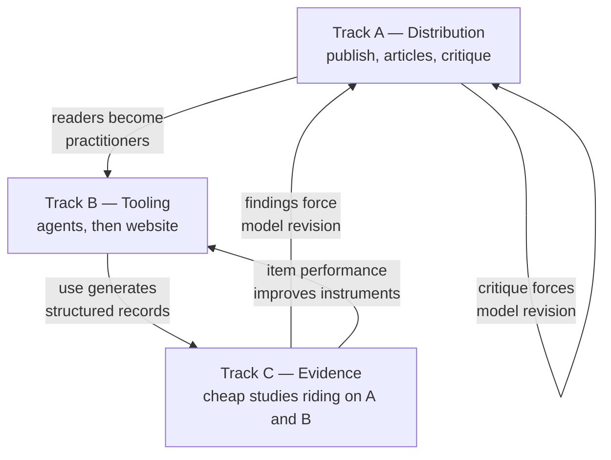

# The Way Forward

## The problem with the current plan

The V7 design set ends with a validation programme ([Design/20-testing.md](../Design/20-testing.md)) that assumes a funded research operation: recruited samples, trained raters, longitudinal panels, blind coding, pre-registration. It is a good programme. It will never be run by its author.

This creates a deadlock. The model cannot be used with confidence until it is validated. It cannot be validated without resources. Resources will not appear for an unpublished, untested framework by an unaffiliated author. The model sits in the folder and nothing happens.

## The reversal

The sequence has to invert.

| Assumed sequence | Actual sequence available |
| --- | --- |
| Build → validate → publish → use | Build → publish → use → instrument the use → let evidence accumulate |

This is not a lowering of standards. It is a recognition that **validation is not a gate the model passes through once**, and that several of the most informative studies in the programme cost almost nothing if they are attached to something that is already happening.

Three consequences follow, and they shape everything else in this folder.

**Distribution comes before evidence.** An unread model generates no critique, no collaborators, and no data. Publishing early is not premature — it is the only action that makes the later actions possible. The cost of publishing something wrong is manageable if it is labelled as speculative, versioned, and revisable. The cost of publishing nothing is total.

**Tooling comes before studies.** A working assessment tool generates structured observations as a byproduct of being useful to someone. That is the only data source available without a budget. Building the tool is therefore a research action, not just a product action.

**Evidence accumulates rather than arrives.** There is no moment at which the model becomes validated. There is a slowly improving picture, most of which will be weak, some of which will be genuinely informative, and a small part of which may be strong enough to refute something. The plan is built to notice the refutations.

## Three parallel tracks

The work divides into three tracks that run concurrently and feed each other. Nothing in the plan requires all three to succeed.

**Track A — Distribution.** Cost: time. Publish the model in a citable, versioned, revisable form. Write for the audiences that can use it. Invite critique explicitly and act on it publicly. See [07-publishing.md](07-publishing.md) and [08-articles.md](08-articles.md).

**Track B — Tooling.** Cost: time and tokens. Build the assessment agent first, because it is small, private, and useful immediately. Build the website second, because it is the only route to scale. See [05-assessment-agents.md](05-assessment-agents.md) and [06-website-platform.md](06-website-platform.md).

**Track C — Evidence.** Cost: near zero, because each study attaches to work happening anyway. See [03-cheap-evidence.md](03-cheap-evidence.md).

## Phases

Phases are ordered by dependency, not by calendar. Each has a precondition, an output, and an explicit stop condition.

### Phase 0 — Resolve and freeze

**Precondition:** none.

**Work:** settle the open decisions in [Design/10-decisions.md](../Design/10-decisions.md), write the model files properly from the design set, and freeze V7 as a version. A model that is still being restructured cannot be published, taught, or built into a tool.

**Output:** a complete, internally consistent V7 model set.

**Stop condition:** if resolving the decisions reveals that the position set cannot be made coherent, the honest outcome is a smaller model. Shrinking is a legitimate result.

### Phase 1 — Self-refutation before distribution

**Precondition:** Phase 0.

**Work:** run the free discriminability checks described in [03-cheap-evidence.md](03-cheap-evidence.md) — principally whether the model's own position descriptions can be told apart by a reader who does not know which is which. This costs an afternoon and some tokens.

This phase exists because it is the only cheap opportunity to discover that the model is incoherent **before** investing in publishing and tooling. It should be run with a genuine willingness to get a bad answer.

**Output:** a discriminability report; a revised or reduced position set.

**Stop condition:** if the positions cannot be distinguished from their own descriptions, they will not be distinguishable in people. Collapse the confusable pairs and re-run. If collapsing does not fix it, the model is a vocabulary and not a graph, and it should be published as a vocabulary.

### Phase 2 — Publish

**Precondition:** Phase 1 passed, or the model reduced until it passes.

**Work:** the publication set in [07-publishing.md](07-publishing.md) — a citable archived version, a public repository, and a plain-language entry point. Then the first two articles from [08-articles.md](08-articles.md).

**Output:** a model that exists publicly, can be cited, and can be argued with.

**Stop condition:** none. This phase is unconditionally worth completing.

### Phase 3 — Build the assessment agent

**Precondition:** Phase 0. Does not require Phase 2.

**Work:** the agent system in [05-assessment-agents.md](05-assessment-agents.md). Local, private, single-practitioner. This is the highest-value build because it is small, it forces every construct to become operational, and it produces structured records from the first use.

**A second benefit that is easy to miss:** building the classifier forces every position description to be written precisely enough for a machine to apply it. Constructs that cannot survive that exercise should not be in the model. The build is a validation activity disguised as an engineering activity.

**Output:** a working interview-and-classification pipeline; a coding manual as a side effect.

**Stop condition:** if the classifier cannot reach acceptable agreement with a second independent classifier on the model's own vignettes, that is the same failure as Phase 1 and has the same remedy.

### Phase 4 — Field use

**Precondition:** Phases 2 and 3.

**Work:** use the model with real people — coaching conversations, team retrospectives, the author's own workplace. Record every assessment in the structured format the agent produces. Accumulate cases.

**Output:** a case corpus. This is the single most valuable asset the project can build without money, and it compounds.

**Stop condition:** if field use repeatedly produces cases that do not fit any position, the graph is missing nodes. That is a finding, not a failure.

### Phase 5 — The website

**Precondition:** Phase 3, and enough field use to know which questions work.

**Work:** [06-website-platform.md](06-website-platform.md), staged. The site is deliberately last among the build activities because building a public assessment tool around questions that have never been tried on anyone is the most expensive possible way to discover that the questions are bad.

**Output:** scale, and the item-level data that scale makes possible.

**Stop condition:** if traffic never materialises, the agent and the case corpus remain valuable on their own. The site is an amplifier, not a foundation.

### Phase 6 — Collaborator recruitment

**Precondition:** Phases 2 and 4.

**Work:** approach people who have what the project lacks — access to samples, workflow telemetry, or institutional standing. A published model with a working tool and a case corpus is a far more attractive proposition than a folder of documents.

**Output:** the studies in [Design/20-testing.md](../Design/20-testing.md) that genuinely cannot be done alone, run by someone who can do them.

**The realistic target** is not a research grant. It is one organisation willing to share anonymised workflow data, or one academic willing to supervise a student project. Either would move the model further than everything in Phases 0 to 5 combined.

## What to do first

If only one thing happens, it should be **Phase 1**. It is the cheapest, it is the only step that can save all the others from being wasted, and it is the step most likely to be skipped because its purpose is to find problems.

If two things happen, add **Phase 3**. The agent is the load-bearing artefact of the whole plan: it makes the model operational, it generates the case corpus, and it is the component the website is later built around.

## What this plan refuses to do

- **Wait.** There is no version of this project that begins with funded validation.
- **Overclaim to get attention.** The model's credibility is its only asset. A single instance of presenting it as validated would cost more than any amount of reach it bought.
- **Grow the model to look more complete.** Every phase has a stop condition that permits the model to shrink. A smaller model that survives contact with reality is worth more than a comprehensive one that has never been tested.
- **Treat scale as evidence.** Ten thousand self-assessments from a public website is a large sample of self-selected, contaminated, self-reported data. It is genuinely useful for some questions and worthless for others, and [03-cheap-evidence.md](03-cheap-evidence.md) is careful about which is which.

## How the plan fails

Stated so the failure is recognisable early.

| Failure mode | Early signal | Response |
| --- | --- | --- |
| The model is published, read, and ignored | No critique, no adoption, no citations | The model may be correct and unnecessary. Consider whether the vocabulary alone is the deliverable |
| The tool is built and never used | The author does not use it either | Wrong artefact. The questions are probably too long or too clinical |
| Field cases do not fit the positions | Repeated forced classifications with low confidence | Revise the graph. This is the best possible failure |
| The site attracts traffic and produces junk data | High completion, low internal consistency | Item problem, not model problem. Fix the instrument |
| The model becomes popular and gets misused | Position labels appearing in performance discussions | Escalate the misuse warnings; consider restricting the tool's outputs |

The last row is the one worth watching hardest. An unvalidated framework that becomes fashionable is more dangerous than one that is ignored, and the plan's distribution-first strategy makes that outcome more likely rather than less. [02-use-without-validation.md](02-use-without-validation.md) exists to constrain it.
