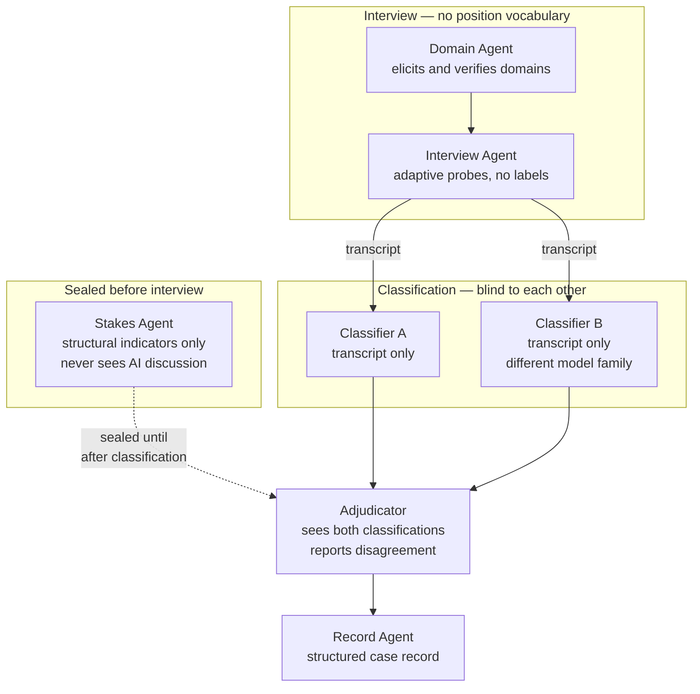

# Assessment Agents

A multi-agent system that runs the interview, produces a classification, and checks itself. This is the load-bearing artefact of the whole plan: it makes the model operational, generates the case corpus, and is the component the website is later built around.

The design has an additional property that is easy to miss and is arguably its main justification. **Software can enforce methodological rules that humans reliably forget.** The model demands that identity stakes are measured before positions are observed, that the interviewer never names a position, and that classification is blind to the interviewer's hypothesis. Human practitioners violate all three routinely, under time pressure and in good faith. A pipeline can make the violations impossible.

## Why more than one agent

A single assistant asked to "assess someone using this model" will do the wrong thing in a predictable way: it will form a hypothesis in the first two exchanges and spend the rest of the conversation confirming it. This is the same failure the model attributes to `GE` Guarded Evaluation, and it is not fixed by instructing the model to avoid it.

Separation of roles fixes it structurally. Each agent sees only what its role requires, and the handoffs are the control points.



## The agents

### 1. Stakes Agent

**Runs first, in isolation. Its output is sealed until classification is complete.**

**Purpose.** Establish Identity Stakes per domain from structural evidence, before any AI-related discussion can contaminate it.

**Sees.** The person's work history, tenure, training, income structure, and how they describe their own work when AI has not been mentioned.

**Must never see.** Anything about the person's AI use, attitudes, or reactions.

**Why this agent exists.** This is the single most important methodological rule in the model. Stakes assessed after observing someone's reaction to AI explains that reaction circularly and makes the model unfalsifiable. Humans violate this constantly because the reaction is the salient thing in the conversation. A sealed pre-assessment makes it structurally impossible.

**Output.** Per domain: stakes level, the indicators supporting it, and a confidence rating. Written to a sealed record.

### 2. Domain Agent

**Purpose.** Establish the two to six domains the assessment will cover.

**Method.** The three-step protocol — work history scan by outputs rather than titles, consolidation by skill family, verification by reading the list back and recording the corrections.

**Why separate from the interview.** Domains must be fixed before positions are discussed. An interviewer that discovers domains as it goes will carve them around where interesting AI reactions appear, which biases the whole assessment toward domains where something is happening.

### 3. Interview Agent

**Purpose.** Elicit the evidence needed for classification, one domain at a time.

**Hard constraints, enforced by the harness rather than by instruction alone:**

- **Never uses a position name or code.** Not once, not in a summary, not in a closing reflection. Output is checked against a blocklist before it reaches the person.
- **Never offers an interpretation.** No "it sounds like you might be...". The interview collects; it does not conclude.
- **Never asks a person to self-classify.**
- **Asks indirectly.** The probe set from [Design/30-practitioner-use.md](../Design/30-practitioner-use.md), which elicits stories rather than self-descriptions.

**Adaptive behaviour.** The agent's genuine advantage over a static questionnaire is follow-up. When someone says the tool disappointed them, the useful next move is asking for the specific occasion. Adaptive probing is what a form cannot do and is the main reason to build an agent at all.

**A structural safeguard on adaptivity.** The interview agent should be given the *evidence requirements* for classification — what needs to be established — without being given the position descriptions themselves. It knows it must establish how the person responded to positive evidence; it does not know that this distinguishes `OE` Open Evaluation from `GE` Guarded Evaluation. This keeps it collecting rather than confirming.

**Termination.** Ends when the evidence requirements are met for each domain, or when the person has had enough. Both are acceptable; the second is recorded as incomplete.

### 4. Classifiers A and B

**Purpose.** Assign a position per domain from the transcript.

**Sees.** The transcript and the coding manual. Nothing else — not the stakes assessment, not the other classifier, not the practitioner's impressions.

**Why two, and why different.** Two independent classifiers produce an agreement measure on every case, at almost no cost. This turns the inter-rater reliability study from an unaffordable research project into a byproduct of ordinary use. Using different model families reduces the chance that agreement is an artefact of shared training rather than genuine signal in the transcript.

**Output, per domain:**

| Field | Content |
| --- | --- |
| Position | Code and name |
| Attributes | With supporting evidence for each |
| Confidence | High, moderate, or low |
| Supporting quotes | Verbatim, with location in the transcript |
| Contradicting evidence | What in the transcript argues against this classification |
| Alternative considered | The second-best fit and why it was rejected |
| Fit quality | Comfortable, forced, or no good fit |

The last two fields are the important ones. **"No good fit" must be an available answer**, and a classifier that never uses it is not being useful — it is confirming that the model is expressive enough to describe anyone, which is already known.

**The withheld stakes assessment is what makes this honest.** Because the classifier cannot see the stakes, the model's central prediction — that stakes drive the stance fork — is genuinely tested on every case rather than assumed.

### 5. Adjudicator

**Purpose.** Compare the two classifications, unseal the stakes assessment, and produce the case record.

**Does not resolve disagreement by picking a winner.** Disagreement is data. The record preserves both classifications and flags the disagreement by position pair, which accumulates directly into the reliability evidence described in [03-cheap-evidence.md](03-cheap-evidence.md).

**Checks the stakes prediction.** Now that both are available: did the stakes assessment predict the position? Agreement is weak confirmation; systematic mismatch is a finding worth having.

**Output.** A case record, an agreement flag, and — where the classifiers disagreed or either reported a forced fit — a note identifying what additional evidence would have resolved it. That note improves the interview protocol over time.

### 6. Record Agent

**Purpose.** Write the case into a fixed schema, and strip identifying material.

**Why separate.** Anonymisation that depends on the practitioner remembering to anonymise does not happen. A dedicated step that removes names, employers, and identifying project details before storage means the corpus is safe to keep and later to share.

### 7. Research Agent

**Runs outside the assessment pipeline.**

**Purpose.** Keep the model current. Scan for new work in the adjacent literatures, watch for capability releases and tooling shifts that constitute `⚡` triggers, and flag published findings that contradict a model claim.

**Why this matters more than usual here.** The model describes adaptation to a moving target. A framework written against one generation of tooling degrades as the tooling changes, and the degradation is invisible from inside. A standing scan is how V7 avoids becoming V6.

**Second function: adversarial review.** The critic roles described in [03-cheap-evidence.md](03-cheap-evidence.md) are the same agent in a different configuration, and this is where the C2 study lives operationally.

## Building it as a Claude Skill

The pipeline suits a skill structure well, because the model documents are exactly the kind of reference material a skill is designed to carry.

```
ai-adaptation-assessment/
  SKILL.md                    entry point, routing, hard constraints
  reference/
    positions.md              position definitions for classifiers
    coding-manual.md          decision rules for ambiguous cases
    probes.md                 interview probe bank by evidence target
    evidence-requirements.md  what must be established, without position names
    scope-limits.md           when to stop and refer out
  agents/
    stakes.md
    domain.md
    interview.md
    classify.md
    adjudicate.md
  schema/
    case-record.json          the structured output format
  scripts/
    check_vocabulary.py       blocklist check on interview output
    agreement.py              agreement statistics across the corpus
```

**Design notes specific to the skill format:**

- **`SKILL.md` carries the constraints, not the content.** The routing logic and the prohibitions belong in the always-loaded entry point. The position descriptions are large and should load only for the classification step, which also keeps them out of the interview agent's context.
- **The coding manual is written during the build and is a deliverable in its own right.** Writing decision rules precise enough for a machine is the exercise that reveals which constructs are underspecified. Any position that cannot be given a workable rule is a candidate for removal.
- **The vocabulary blocklist is a script, not an instruction.** Instructions to avoid saying something are unreliable under long conversations. A deterministic check is not.
- **Separate sessions, not separate prompts.** Blinding only works if the classifiers genuinely cannot see each other. Running them in one context with instructions not to peek does not blind anything.

## Safeguards the pipeline must enforce

These are non-negotiable and belong in code rather than in prose.

| Safeguard | Implementation |
| --- | --- |
| No position vocabulary reaches the participant | Blocklist check on every interview turn |
| Stakes sealed until classification complete | Separate store, no read access from classifier context |
| Classifiers blind to each other | Separate sessions, no shared context |
| Distress detection | Standing check for indicators of severe `IS` Identity Shock or `BO` Burnout; stops the assessment and surfaces referral guidance |
| Scope check | Detects out-of-scope cases — assistive use, involuntary exposure, non-knowledge work — and declines rather than producing a confident misdiagnosis |
| Records anonymised before storage | Dedicated step, not a practitioner responsibility |
| Status disclosure | The unvalidated-model paragraph presented before the interview begins, every time |

The distress check deserves emphasis. An automated system conducting an extended conversation about someone's professional identity will occasionally encounter genuine distress. It must have a defined stopping behaviour, and it must not attempt to help.

## Cost control

Relevant both to running the pipeline privately and to the website in [06-website-platform.md](06-website-platform.md), where cost scales with users.

| Measure | Effect |
| --- | --- |
| Cheap model for the interview, capable model for classification | The interview is many turns of simple work; classification is one turn of hard work. This is where nearly all the saving is |
| Reference material loaded per step, not per session | The interview agent never needs the position descriptions |
| Cache the coding manual and position definitions | Static across every assessment |
| Second classifier only where the first reports low confidence or a forced fit | Full dual classification on a sample plus all hard cases retains most of the reliability signal at a fraction of the cost |
| Hard turn cap on the interview | Prevents runaway sessions |
| Batch the corpus-level analysis | Agreement statistics run periodically, not per case |

The single largest saving is model selection by role. The design's separation of concerns makes that saving available, which is a pleasant case of the methodologically correct architecture also being the cheap one.

## What the system must not be built to do

- **Produce a position label for the person assessed.** The output goes to a practitioner or to a research record, not to the participant. Returning a label converts the tool into a personality test and contaminates every subsequent observation of that person.
- **Compare people.** No leaderboards, no team rankings, no distributions with names attached.
- **Persist a profile across sessions without explicit consent.** A longitudinal record is valuable and must be opted into.
- **Present confidence it does not have.** Where classifiers disagree, the record says so. A system that hides its own uncertainty to look competent is worse than no system.

## Development order

1. **Coding manual and evidence requirements.** Before any code. This is where the model is made operational, and it is where it will fail if it is going to.
2. **Classifier, tested against the C1 vignettes** from [03-cheap-evidence.md](03-cheap-evidence.md). Classification is testable in isolation without any participant.
3. **Dual classification and agreement measurement.** Establishes whether the manual works before anything is built on top of it.
4. **Interview agent,** tested by think-aloud with a small number of people.
5. **Stakes and domain agents,** which are simpler and depend on the interview format being settled.
6. **Record schema and anonymisation.**
7. **Research agent,** last, and independent of the rest.

Step 2 is the real test. A classifier that cannot reliably apply the model to cases written to be unambiguous will not apply it to real ones, and discovering that early costs an afternoon rather than a project.
