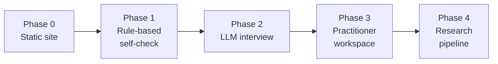

# Website and Platform

A public site, staged so that each phase is useful on its own and none depends on the next being built. The sequence is deliberate: the expensive, contamination-prone, data-generating parts come last, after the questions have been tested on real people.

## What the site is for

Three purposes, in order of how well they are served:

1. **Distribution.** A findable, readable, citable home for the model. This is the purpose that justifies the site on its own.
2. **Utility.** A self-assessment that helps an individual think about their own situation.
3. **Evidence.** Item-level data at a scale nothing else in the plan can reach.

The third is a byproduct and must never become the driver. A site designed to harvest research data produces a worse experience, attracts fewer users, and yields worse data than one designed to be genuinely useful.

## Staging

Each phase ships and stops. If nothing after Phase 1 is ever built, the project still has a public model and a working self-check.

---

## Phase 0 — Static site

**Purpose.** The model exists at a URL.

**Content.** The model documents rendered as navigable pages, a plain-language introduction, the epistemic status stated on every page rather than buried, the citable version reference, and an explicit invitation to criticise with a route for doing so.

**Build.** A static site generator over the existing markdown, published from the repository. Astro, Docusaurus, or MkDocs all work; the deciding factor is that the source stays as markdown in version control so the documents remain the single source of truth.

**Cost.** Hosting is free at this scale. A domain is the only expense.

**Why this phase alone is worth it.** A model that lives in a repository folder is not published in any meaningful sense. The static site is the difference between a document and a thing that can be read, linked, and argued with.

**Design constraint that matters.** The epistemic status must be visible on the page a reader lands on, not one click away. Most readers will arrive at a single position description from a search result and never see the front page. Every position page needs the warning in the page, not in the site.

---

## Phase 1 — Rule-based self-check

**Purpose.** A fixed questionnaire that returns a reflective summary, with no language model involved.

**Why rule-based first.** Three reasons, each sufficient. It costs nothing per user, so traffic cannot produce a bill. It is deterministic, so item behaviour can be analysed cleanly. And it forces the questions to be good enough to work without a conversational system covering for them.

**Design.**

- Domain-first. The person names one to three areas of their work before any AI question. This is the model's central framing and it belongs in the interaction, not in the explanation.
- Stakes questions before AI questions, in that order, for the reason given throughout.
- Items describe behaviour and feeling. No item names a position.
- Short. Completion matters more than coverage, and a long instrument produces a self-selected sample of unusually motivated respondents.

**Output to the user.** This is the design decision that matters most on the whole site.

**It should not return a position label.** A label is a horoscope: it is memorable, it feels like a result, it will be screenshotted and shared, and it contaminates the person permanently. It also implies a measurement the instrument cannot make.

**It should return a reflection.** What the answers suggest about the situation, framed as observations and questions. For example: *"The answers describe very different relationships with AI across the three areas named — worth noticing that the area with the most training behind it is also the one with the tightest limits."* Then relevant reading, and questions to sit with.

This is less satisfying than a label and it is the difference between a tool that helps and a tool that harms. It is also more honest about what the instrument can support.

**Cost.** Free.

---

## Phase 2 — LLM-guided interview

**Purpose.** The adaptive interview from [05-assessment-agents.md](05-assessment-agents.md), available publicly.

**Precondition.** The questions have been tested with real people, and the agent pipeline works privately. Building a public conversational assessment around untested questions is the most expensive available way to discover the questions are bad.

**What the conversation adds over the form.** Follow-up. When someone says the tool disappointed them, the useful next move is asking for the specific occasion, and no form can do that. Adaptive probing is the entire justification for the added cost and complexity.

**Constraints inherited from the agent design, all of which apply more strictly in public:**

- The interview never names a position.
- The interview never offers an interpretation.
- Distress detection with a defined stop and referral behaviour, which matters far more with anonymous members of the public than with a practitioner's own clients.
- Scope detection that declines out-of-scope cases rather than producing a confident misdiagnosis.
- The unvalidated-model disclosure before the conversation starts.

**Cost control.** This is the first phase with a marginal cost per user, and an uncapped public LLM endpoint is a financial hazard.

| Measure | Purpose |
| --- | --- |
| Cheap model for interview turns | The interview is many turns of simple work. This is where nearly all the cost sits |
| Hard turn cap | Bounds the worst case per session |
| Rate limiting per address and per session | Prevents abuse and scripted extraction |
| Global daily spend cap with graceful degradation to the Phase 1 form | Guarantees the bill cannot run away |
| Cached system context | The reference material is identical across every session |
| Classification only on request | Most visitors want the reflection, not a research-grade classification |

The degradation path matters. When the cap is reached the site should fall back to the rule-based questionnaire rather than showing an error, which means Phase 1 remains live permanently rather than being replaced.

---

## Phase 3 — Practitioner workspace

**Purpose.** A private area for coaches, managers, and researchers using the model with others.

**Features.** Structured case records, the domain-by-position grid for teams, aggregation with a minimum group size enforced in code, export, and the anonymisation step applied before anything is stored.

**Why authenticated and separate.** Practitioner use involves records about third parties, which is a different legal and ethical situation from an individual reflecting on themselves. Keeping it behind a boundary makes the different rules enforceable.

**Constraints in code, not in terms of service:**

- Team aggregation refuses to render below the minimum group size.
- Individual records are not exportable in a form that attaches a position to a name.
- Records carry a retention limit and expire.
- The workspace warns explicitly when a pattern of use resembles performance assessment.

**Possible sustainability.** This is the only component with a plausible revenue model. A modest subscription for practitioners would cover hosting and inference for the free tiers. Worth noting as an option; not worth designing the project around.

---

## Phase 4 — Research pipeline

**Purpose.** Turn accumulated use into the analyses in [03-cheap-evidence.md](03-cheap-evidence.md).

**Components.** Item analysis, structure recovery run without imposing the model's grouping, test-retest for returning users, classifier agreement statistics, and a public results page.

**The public results page is the important part.** Publishing what the data says, including where it fails to support the model, is what separates this project from marketing. It should show item performance, agreement rates, and any structure that did or did not emerge, updated as data accumulates.

**Consent.** Research use requires explicit, separate, opt-in consent at the point of collection, with the default set to no. Consent buried in terms of service is not consent, and a project whose credibility is its only asset cannot afford to treat it as one.

**Honesty requirement.** Every published figure carries the sampling constraints in the same breath as the number. The sample is self-selected, self-reported, and exposed to the framing by the act of participating. A limitations section at the bottom of the page does not discharge this.

---

## Architecture

Deliberately boring, because the interesting risk in this project is not technical.

| Layer | Choice | Reason |
| --- | --- | --- |
| Content | Markdown in the repository | Documents stay the single source of truth |
| Site | Static generator, statically hosted | Free, fast, no operational burden |
| Questionnaire | Client-side, no server | No cost, no data leaving the browser unless submitted |
| Interview | Small serverless backend holding the API key | The key cannot be in the client |
| Storage | Minimal. Nothing stored without opt-in | Anything stored is a liability |
| Workspace | Standard authenticated application | Only built if Phase 3 is reached |

**The privacy position, which is also the cheapest architecture.** The site collects nothing by default. The questionnaire runs in the browser. The interview transcript is not retained unless the person opts in to research use. There are no accounts for the public tiers and no analytics that identify individuals. This is simultaneously the most defensible ethical stance, the lowest operating cost, and the simplest thing to build — a rare alignment worth taking advantage of.

---

## What the site must never do

| Prohibited | Reason |
| --- | --- |
| Return a position label as a result | Contaminates the person permanently; implies a measurement that does not exist |
| Produce a shareable badge or score | Turns an unvalidated framework into an identity marker |
| Compare a user to others | No norms exist. Any percentile would be fabricated |
| Offer a team or employee assessment product to organisations | Directly enables the prohibited use in [04-manager-hr-guide.md](04-manager-hr-guide.md) |
| Describe itself as validated, evidence-based, or scientific | It is none of these |
| Retain conversation transcripts without opt-in | Sensitive content about people's working lives |
| Recommend a target position | The model is descriptive. A site that tells people where to get to has abandoned that |

The second row deserves emphasis, because it is the design most likely to be proposed and the one that would most reliably drive traffic. A shareable result is exactly the mechanism by which an unvalidated framework becomes a fashionable label applied to people, and the model would not survive it.

## Order of work

1. Phase 0, immediately after the model is frozen.
2. Phase 1, after the questions have been through think-aloud testing.
3. Phase 2, after the agent pipeline works privately and the items have survived contact with real respondents.
4. Phase 3, only if practitioners other than the author are actually using the model.
5. Phase 4, only once there is enough data for an analysis that is not embarrassing.

**A useful test before starting any phase:** if this phase is the last thing ever built, is the result still worth having? Phases 0 and 1 pass easily. Phase 2 passes. Phase 3 passes only if there are practitioners. Phase 4 is the only one that depends entirely on what came before, which is why it is last.
